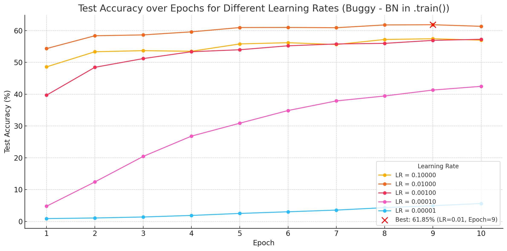
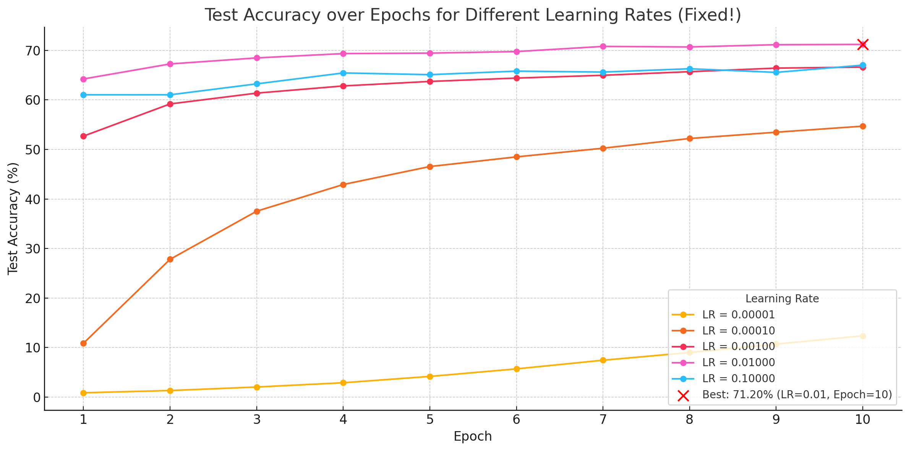

### This is a repo for basic ImageNet1K running validation eval. Additionally, also to train a classifier on top of frozen ImageNet1k features on downstream datasets - CIFAR100.

#### Effect of BatchSize and not putting BatchNorm Layers to .eval() when validating or testing the model.

| Configuration              | Top-1 Accuracy (%) | Top-5 Accuracy (%) |
| -------------------------- | ------------------ | ------------------ |
| 🟩 `model.eval()` (any BS) | **76.15**          | **92.87**          |
| 🟥 `model.train()`, BS=256 | 75.54              | 92.58              |
| 🟥 `model.train()`, BS=8   | 69.52              | 89.15              |
| 🟥 `model.train()`, BS=4   | 59.94              | 82.85              |
| 🟥 `model.train()`, BS=2   | 31.24              | 56.40              |

#### Effect of linear probing on CIFAR100 and not putting BatchNorm Layers to .eval() when validating or testing the model.

CIFAR100, just training the classifier grid search on `LR (0.1 to 0.00001) with BS 128, and SGD`. **Best: 61.85% Top 1 Accuracy**. (which is quite a lot higher than what we see 54.51 when using https://github.com/linusericsson/ssl-transfer)

**Note**: this is buggy with params.requires_grad=False but BN is in .train() mode.

**Best test accuracy: 71.20% at Epoch 10, for Learning Rate = 0.01000**. Makes a hell of a lot of difference!!! Almost 10 p.p., which is non-trivial at the very least.

 
**Note**: *cifar100_train_eval_linear_classifier_gridsearch_buggy.py* is buggy with `params.requires_grad=False` but `BN` is in `.train()` mode when the `model.train()` step takes place. *cifar100_train_eval_linear_classifier_gridsearch.py* is the fixed file.
